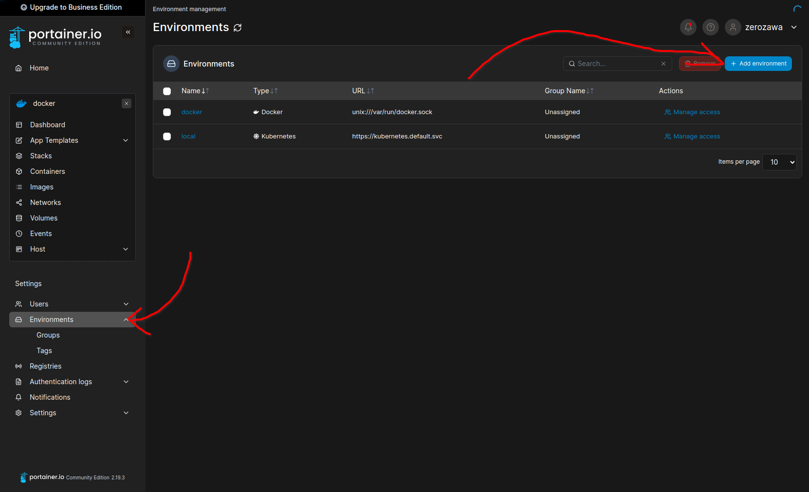
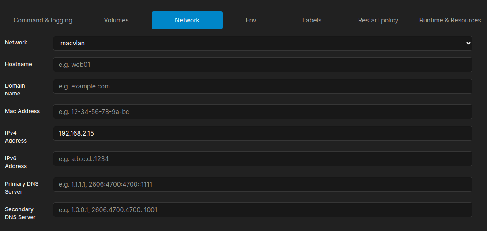
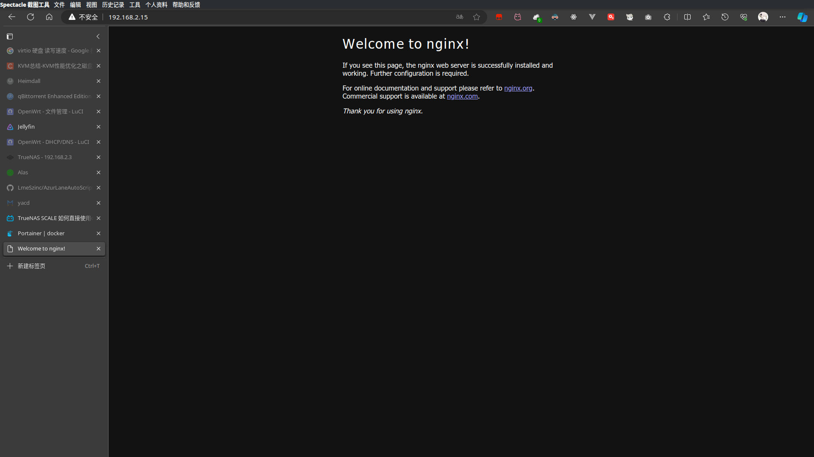
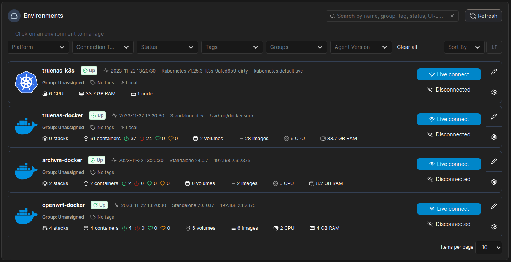

参考：

- [TrueNAS SCALE 如何直接使用 docker，使用 K8S 安装 portainer 管理 docker](https://www.truenasscale.com/2022/01/25/510.html)

<div style="position: relative; width: 100%;padding-top: calc(100% * 720 / 1280);border: 2px black solid;">
    <iframe src="//player.bilibili.com/player.html?aid=634328482&bvid=BV1pb4y1b7Sc&cid=446853142&p=1" scrolling="no" border="0" frameborder="no" framespacing="0" allowfullscreen="true" style="position: absolute; width: 100%; height: 100%; top: 0;"></iframe>
</div>

本文章基本算是搬运。

## 前言

在 truenas 上使用 docker 是一件麻烦的事情，即便是在 scale 版本上也是如此。原因是 truenas scale 使用的是 k3s 来管理容器，本身也禁用掉了 docker 的 bridge 网络和 iptables。好在 truenas scale 在一定程度上可以运行自定义的 docker,而不是把用户的选择局限在软件商店中。然而运行自定义 docker 也有很多局限，比如不能随心所欲的挂载设备，像 `/dev/dri` 这一类的难以直接映射进容器之中。（虽然使用 TrueCharts 可以挂载设备，但是 TrueChart 最近的风评，emmm, 让人很难放心。况且 TrueCharts 应用虽然多，但也是有极限的。）

也不是没有曲线救国的方法，比如，truenas 只负责存储，暴露 nfs、samba 服务，然后另开虚拟机运行其他服务。

然而这个方法也有缺点，那就是吃大量存储的服务还是得运行在 truenas 上，比如数据库等。而且远程文件系统对于有些 docker 应用使用的本地 db 来说不是很友好，会吃掉很多的网络 io，还得是得折衷将部分数据放在其他虚拟机的本地 volume 里。而且脑袋里总萦绕着 “truenas 都已经吃了这么多内存了，那何不把其他虚拟机停掉，服务统一放在 truenas 里呢？” 这种想法，非常想要折腾一番。

好在搜到了[Sagit](https://www.truenasscale.com/)大佬的博客，顺利地在 truenas 上开启了 portainer.

## 操作

操作可以看视频，也可以看我总结的。

首先拷贝以下的文件到 truenas 中，注意修改其中用 `###` 标注出的两个地方

```yaml
---
# Source: portainer/templates/namespace.yaml
apiVersion: v1
kind: Namespace
metadata:
  name: portainer
---
# Source: portainer/templates/serviceaccount.yaml
apiVersion: v1
kind: ServiceAccount
metadata:
  name: portainer-sa-clusteradmin
  namespace: portainer
  labels:
    app.kubernetes.io/name: portainer
    app.kubernetes.io/instance: portainer
    app.kubernetes.io/version: 'ce-latest-ee-2.10.0'

---
# Source: portainer/templates/rbac.yaml
apiVersion: rbac.authorization.k8s.io/v1
kind: ClusterRoleBinding
metadata:
  name: portainer
  labels:
    app.kubernetes.io/name: portainer
    app.kubernetes.io/instance: portainer
    app.kubernetes.io/version: 'ce-latest-ee-2.10.0'
roleRef:
  apiGroup: rbac.authorization.k8s.io
  kind: ClusterRole
  name: cluster-admin
subjects:
  - kind: ServiceAccount
    namespace: portainer
    name: portainer-sa-clusteradmin
---
# Source: portainer/templates/service.yaml
apiVersion: v1
kind: Service
metadata:
  name: portainer
  namespace: portainer
  labels:
    io.portainer.kubernetes.application.stack: portainer
    app.kubernetes.io/name: portainer
    app.kubernetes.io/instance: portainer
    app.kubernetes.io/version: 'ce-latest-ee-2.10.0'
spec:
  type: NodePort
  ports:
    - port: 9000
      targetPort: 9000
      protocol: TCP
      name: http
      ### 修改对应的端口
      nodePort: 9000
    - port: 9443
      targetPort: 9443
      protocol: TCP
      name: https
      nodePort: 9443
    - port: 30776
      targetPort: 30776
      protocol: TCP
      name: edge
      nodePort: 30776
  selector:
    app.kubernetes.io/name: portainer
    app.kubernetes.io/instance: portainer
---
# Source: portainer/templates/deployment.yaml
apiVersion: apps/v1
kind: Deployment
metadata:
  name: portainer
  namespace: portainer
  labels:
    io.portainer.kubernetes.application.stack: portainer
    app.kubernetes.io/name: portainer
    app.kubernetes.io/instance: portainer
    app.kubernetes.io/version: 'ce-latest-ee-2.10.0'
spec:
  replicas: 1
  strategy:
    type: 'Recreate'
  selector:
    matchLabels:
      app.kubernetes.io/name: portainer
      app.kubernetes.io/instance: portainer
  template:
    metadata:
      labels:
        app.kubernetes.io/name: portainer
        app.kubernetes.io/instance: portainer
    spec:
      nodeSelector: {}
      serviceAccountName: portainer-sa-clusteradmin
      containers:
        - name: portainer
          image: 'portainer/portainer-ce:latest'
          imagePullPolicy: Always
          args:
            - '--tunnel-port=30776'
          volumeMounts:
            - name: data
              mountPath: /data
            - name: docker
              mountPath: /var/run/docker.sock
          ports:
            - name: http
              containerPort: 9000
              protocol: TCP
            - name: https
              containerPort: 9443
              protocol: TCP
            - name: tcp-edge
              containerPort: 8000
              protocol: TCP
          livenessProbe:
            httpGet:
              path: /
              port: 9443
              scheme: HTTPS
          readinessProbe:
            httpGet:
              path: /
              port: 9443
              scheme: HTTPS
          resources:
      volumes:
        - name: data
          hostPath:
            # directory location on host
            ### 修改对应的路径
            path: /mnt/data/truenas_service/portainer
            # this field is optional
            type: Directory
        - name: docker
          hostPath:
            path: /var/run/docker.sock
```

运行

```bash
k3s kubectl apply -f /mnt/data/etc/portainer.yaml # 文件保存的路径
k3s kubectl get ns # 这个和下面的命令确认portainer是否正常启动
k3s kubectl get pod -n portainer
```

浏览器输入 ip:9000(或自己修改的端口) 进入 portainer 页面，创建账号后点击激活 k8s.

之后可以放着 k8s 不管了，连接 docker 环境：



选择 `Docker Standalone` -> `Socket` -> 填一个 name，比如 "docker"

点击确认，就可以进入 docker 环境了。

不过实现提到过，truenas 是禁用了 docker 的 bridge 网络的，无法再以经典方式配置 docker 网络，而是只能转向于 macvlan.

回到 truenas 命令行，创建 macvlan.

```bash
docker network create -d macvlan --subnet=192.168.2.0/24 --gateway=192.168.2.1 -o parent=enp6s18 macvlan
# subnet 填写当前网段即可，gateway 填写当前的网关，当然也可以开新的网段，gateway指向自己，但是需要路由器配置好路由表
# parent 填写当前出口的网卡
# 末尾的 macvlan指的是该网络的名称
```

之后创建 docker 时，选择 macvlan 网络，配置好 ip,由于不再是 bridge,所以无需配置端口映射。



最终效果



添加一下其他节点


