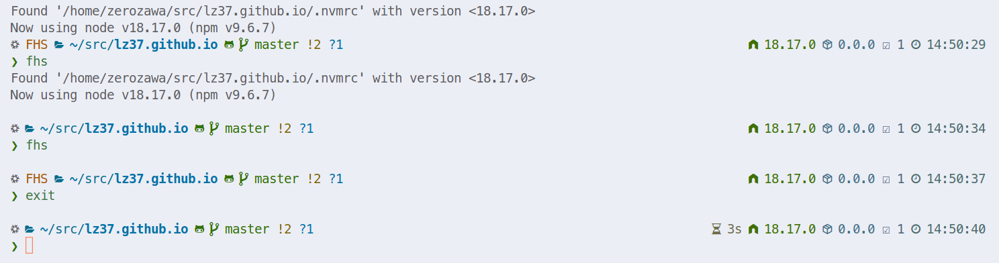

参考：

- [运行非 NixOS 的二进制文件](https://nixos-and-flakes.thiscute.world/zh/best-practices/run-downloaded-binaries-on-nixos)
- [buildFHSUserEnv](https://ryantm.github.io/nixpkgs/builders/special/fhs-environments/)
- [conda/default.nix](https://github.com/NixOS/nixpkgs/blob/master/pkgs/tools/package-management/conda/default.nix)

## FHS 配置

如果仅仅是在 NixOS 上运行非 NixOS 的二进制文件，那么 [nix-alien](https://github.com/thiagokokada/nix-alien) 是一个很不错的选择。但我并没有仔细研究他能否提供一个较为完美的 FHS **开发**环境，所以选择了使用 `pkgs.buildFHSUserEnv` 方法来实现。

如果看过一些 nixpkgs 定义的源码的话，可以发现有一些包是使用了 `pkgs.buildFHSUserEnv` 方法来构建的，比如说 conda,以下是 conda 的 nix 代码：

```nix
{ lib
, stdenv
, fetchurl
, runCommand
, makeWrapper
, buildFHSEnv
, libselinux
, libarchive
, libGL
, xorg
, zlib
# Conda installs its packages and environments under this directory
, installationPath ? "~/.conda"
# Conda manages most pkgs itself, but expects a few to be on the system.
, condaDeps ? [ stdenv.cc xorg.libSM xorg.libICE xorg.libX11 xorg.libXau xorg.libXi xorg.libXrender libselinux libGL zlib]
# Any extra nixpkgs you'd like available in the FHS env for Conda to use
, extraPkgs ? [ ]
}:

# How to use this package?
#
# First-time setup: this nixpkg downloads the conda installer and provides a FHS
# env in which it can run. On first use, the user will need to install conda to
# the installPath using the installer:
# $ nix-env -iA conda
# $ conda-shell
# $ conda-install
#
# Under normal usage, simply call `conda-shell` to activate the FHS env,
# and then use conda commands as normal:
# $ conda-shell
# $ conda install spyder
let
  version = "4.11.0";
  src = fetchurl {
      url = "https://repo.continuum.io/miniconda/Miniconda3-py39_${version}-Linux-x86_64.sh";
      sha256 = "sha256-TunDqlMynNemO0mHfAurtJsZt+WvKYB7eTp2vbHTYrQ=";
  };
  conda = (
    let
      libPath = lib.makeLibraryPath [
        zlib # libz.so.1
      ];
    in
      runCommand "conda-install" { nativeBuildInputs = [ makeWrapper ]; buildInputs = [ zlib]; }
        # on line 10, we have 'unset LD_LIBRARY_PATH'
        # we have to comment it out however in a way that the number of bytes in the
        # file does not change. So we replace the 'u' in the line with a '#'
        # The reason is that the binary payload is encoded as number
        # of bytes from the top of the installer script
        # and unsetting the library path prevents the zlib library from being discovered
        ''
          mkdir -p $out/bin

          sed 's/unset LD_LIBRARY_PATH/#nset LD_LIBRARY_PATH/' ${src} > $out/bin/miniconda-installer.sh
          chmod +x $out/bin/miniconda-installer.sh

          makeWrapper                            \
            $out/bin/miniconda-installer.sh      \
            $out/bin/conda-install               \
            --add-flags "-p ${installationPath}" \
            --add-flags "-b"                     \
            --prefix "LD_LIBRARY_PATH" : "${libPath}"
        '');
in
  buildFHSEnv {
    name = "conda-shell";
    targetPkgs = pkgs: (builtins.concatLists [ [ conda ] condaDeps extraPkgs]);
    profile = ''
      # Add conda to PATH
      export PATH=${installationPath}/bin:$PATH
      # Paths for gcc if compiling some C sources with pip
      export NIX_CFLAGS_COMPILE="-I${installationPath}/include"
      export NIX_CFLAGS_LINK="-L${installationPath}lib"
      # Some other required environment variables
      export FONTCONFIG_FILE=/etc/fonts/fonts.conf
      export QTCOMPOSE=${xorg.libX11}/share/X11/locale
      export LIBARCHIVE=${libarchive.lib}/lib/libarchive.so
      # Allows `conda activate` to work properly
      source ${installationPath}/etc/profile.d/conda.sh
    '';

    runScript = "bash -l";

    meta = {
      description = "Conda is a package manager for Python";
      homepage = "https://conda.io/";
      platforms = lib.platforms.linux;
      license = lib.licenses.bsd3;
      maintainers = with lib.maintainers; [ jluttine bhipple ];
    };
  }
```

可以看到，这个包里藏有两个定义的命令：`conda-shell` 和 `conda-command`，其中 `conda-shell` 就是一个模拟出的 FHS 环境，targetPkgs 中定义了此环境需要的依赖，保证程序运行不出错，runScript 定义了进入此环境后默认执行的命令，这里是 bash，可以根据需要修改。

我们的开发环境也可以模仿此文件入手，以下是我的 common fhs 环境的定义：

```nix
{ config, pkgs, ... }:
let
  otherpkgs = with pkgs; [
    pkg-config
    ncurses
    php
    libffi
    readline
    sqlite
    xorg.libSM
    xorg.libICE
    xorg.libX11
    xorg.libXau
    xorg.libXi
    xorg.libXrender
    libarchive
    libGL
    zlib
  ];
in
{
  # List packages installed in system profile. To search, run:
  # $ nix search wget
  environment.systemPackages = [
    # create a fhs environment by command `fhs`, so we can run non-nixos packages in nixos!
    (
      let base = pkgs.appimageTools.defaultFhsEnvArgs; in
      pkgs.buildFHSUserEnv (base // {
        name = "fhs";
        targetPkgs = pkgs: (
          # pkgs.buildFHSUserEnv 只提供一个最小的 FHS 环境，缺少很多常用软件所必须的基础包
          # 所以直接使用它很可能会报错
          #
          # pkgs.appimageTools 提供了大多数程序常用的基础包，所以我们可以直接用它来补充
          (base.targetPkgs pkgs) ++ otherpkgs
        );
        profile = ''
          export QTCOMPOSE=${pkgs.xorg.libX11}/share/X11/locale
          export LIBARCHIVE=${pkgs.libarchive.lib}/lib/libarchive.so
          export FONTCONFIG_FILE=/etc/fonts/fonts.conf
          export FHS=1
        '';
        runScript = "zsh";
        extraOutputsToInstall = [ "dev" ];
      })
    )
  ];
}
```

将 FHS 环境设置好后，使用 `fhs` 命令便可以进入此环境，然而此时还有一个问题，`runScript` 和默认终端相同的话，难以分辨当前环境是否为 FHS 环境，而且 FHS 环境并不是默认开启的，所以我们要额外的配置一下 zsh.

## ZSH 配置

在 zsh 的配置文件中，我们需要做以下几件事：

- 默认打开 FHS
- 在 zsh 中显示当前环境

### 默认打开 FHS

以 home-manager 的 zsh 配置为例

```nix
{
  # 添加一段 FHS 激活代码
  program.zsh.envExtra = ''
    # enable fhs
    # 如果 FHS 不为 1
    if [[ $FHS != 1 ]]; then
      fhs
    f
  '';
  # 还可以 alias fhs, 使其成为一个 switch
  programs.zsh.shellGlobalAliases = {
    fhs = ''
      if [[ $FHS != 1 ]];then
        fhs
      else
        exit 0
      fi
    '';
  };
}
```

### 显示 FHS 状态

如果是使用 P10K 主题的话，有一个比较简单的方法来显示 FHS 状态。

在对应的 `.p10k.zsh`（默认位置在 `~/.p10k.zsh`，我将它放在`~/.config/home-manager/profile/.p10k.zsh`） 中编辑。

```sh
 # custom
  function prompt_fhs() {
    if [[ $FHS = 1 ]]; then
      p10k segment -f 208 -t 'FHS'
    fi
  }
  # end custo
```

然后在 `POWERLEVEL9K_RIGHT_PROMPT_ELEMENTS` 或者 `POWERLEVEL9K_LEFT_PROMPT_ELEMENTS` 中对应的位置添加 fhs 即可。



## 额外：安装 conda

有了 通用的 fhs 环境，nixos 基本也可以像其他发行版那样使用 conda 了。

但是使用 conda 的安装包时，似乎会出现一些问题，于是我使用 nixos 提供的 conda 软件包来进行 conda 安装。

在 pkgs 里添加 conda 之后，输入`conda-shell`进入 conda 特供环境，然后使用`conda-install`安装 conda 即可。

安装好之后，pkgs.conda 甚至都可以卸载，因为此时我们的 common fhs 环境已经可以正常使用 conda 了，毕竟 pkgs.conda 提供的只是一个特供的安装命令和一个环境而已，而我们的环境已经可以满足 conda 运行条件了。
