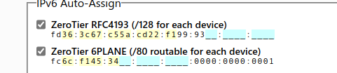
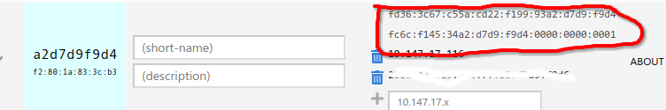
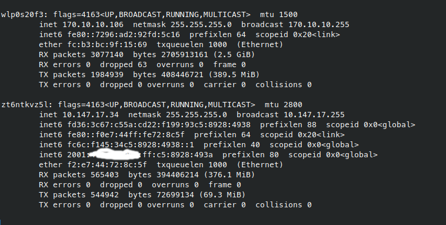
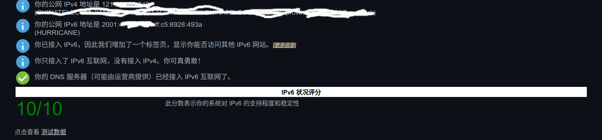

参考：

- [使用 zerotier 搭建自己的 IPv6 网络](https://lisz.me/tech/linux/zerotier.html)
- [利用 ZeroTier 建立 IPv6 隧道](https://lala.im/5015.html)

基本按照上面的文章来就行了，我写的也就是照本宣科，但经过实践还是有些许不一样的地方，下面会加粗标注。

## 环境

- 一台公网服务器，这里我用的是 debian 系统
- 一个可用的固定 IPv6 网段
- client, 可以是路由器（openwrt）也可以是 pc, 路由器建议不要用隧道的 ipv6, 而是用 ISP 给的原生动态 ipv6，所以推荐 pc

## 申请 IPv6 网段

目前，全球范围内除了由基础通信服务商、数据中心、高校等拥有一大批可用的 IPv6 网段外，基本上无法个人进行申请。唯一可用的无限制 IPv6 网段申请就是 [He.net](https://www.tunnelbroker.net/) 提供的 6to4 IPv6 隧道服务。可访问网站进行注册登录，登录后在左上方的 User Functions 里选择 Create Regular Tunnel，然后在 You are viewing from 这个位置会显示出你访问时所用的公网 IP 地址。此处的 IPv4 Endpoint 填的是 ECS 服务器的公网 IPv4 地址，至于以下的 Tunnel Server 应该选择哪个需要在 ECS 服务器上 ping 各个服务器来确定延迟，选取延迟最低的一个位置。(此段转载自[使用 zerotier 搭建自己的 IPv6 网络](https://lisz.me/tech/linux/zerotier.html))

该作者指出阿里云的 vps 最好使用 Fremont、CA、US 的 Tunnel Server，而不是香港的，而我本人使用的狗云的香港服务器，和香港的 Tunnel Server 之间的 ping 值出奇的低，估计两者不在同一个机房也是邻居的关系，所以我选择了香港的 Tunnel Server。**所以在选择 Tunnel Server 之前一定要注意测试一下**。

该作者还不知道为什么申请了一个/48 的网段，搞得我一开始以为一定得 48 的网段呢，网上也有其他教程说一定需要的，但实测不需要，普通的/64 就 ok.

## 配置 IPv6

[He.net](https://www.tunnelbroker.net/)会给出对应的配置文件，先配置好

```bash
# 安装依赖
apt -y update
apt -y install curl sudo net-tools
# 安装 ndppd
apt -y install ndppd
# 修改内核参数
echo "net.ipv6.conf.default.forwarding = 1" >> /etc/sysctl.conf
echo "net.ipv6.conf.all.forwarding = 1" >> /etc/sysctl.conf
echo "net.ipv6.conf.all.proxy_ndp = 1" >> /etc/sysctl.conf
echo "net.ipv6.conf.all.accept_ra = 2" >> /etc/sysctl.conf
sysctl -p
# 安装ZeroTier
curl -s https://install.zerotier.com/ | sudo bash
# 加入网络
zerotier-cli join xxxx
# 设置权限
zerotier-cli set xxxx allowGlobal=true
zerotier-cli set xxxx allowDefault=1
```

来到 zerotier 面板。

勾选



复制 ip，对应的设备是刚刚加入的云服务器



_Managed Routes_ 中添加路由：

| Destination | Via                              |
| ----------- | -------------------------------- |
| ::/0        | 云服务器 fd 开头的内网 ipv6 地址 |

查看刚刚获取的 ipv6 前缀，比如说是 2001:xxx:xx:xxx::/64

_Managed Routes_ 中再添加路由：

| Destination             | Via  |
| ----------------------- | ---- |
| 2001:xxx:xx:xxx:ff::/80 | 不填 |

**IPv6 Auto-Assign** 勾选 _Auto-Assign from Range_

添加

| Range Start           | Range End                         |
| --------------------- | --------------------------------- |
| 2001:xxx:xx:xxx:ff::2 | 2001:xxx:xx:xxx:ff:ffff:ffff:ffff |

然后提交，等待一会，就可以在 zerotier 中看到 ipv6 地址已经分配好了。

服务器上最后配置 ipv6 转发 (/etc/ndppd.conf)：

```conf
route-ttl 30000

address-ttl 30000
; 网卡填写主网卡
proxy eth0 {
   router yes
   timeout 500
   autowire no
   keepalive yes
   retries 3
   promiscuous no
   ttl 30000
   rule 2001:xxx:xx:xxx:ff::/80 {
      auto
      autovia no
   }
}
```

```bash
# ndppd，启动！
systemctl start ndppd
# 启动后看下状态，有概率出问题，出了问题后重启下应该就没事了
systemctl status ndppd
systemctl restart ndppd
```

但实际终端设备上还需要再进行一步配置，假设是 linux 终端的话，执行命令：

```bash
zerotier-cli set xxxx allowGlobal=true
zerotier-cli set xxxx allowDefault=1
```

至此，全部完成。

## 测试



可以看到，`ifconfig` 的输出中，终端机是没有从 wifi 网卡中获取到 ipv6 地址的，但是 zerotier 的虚拟网卡中获得了一个 global ipv6 地址。



梯子关掉后，经典的 ipv6 test 也是可以通过的。
